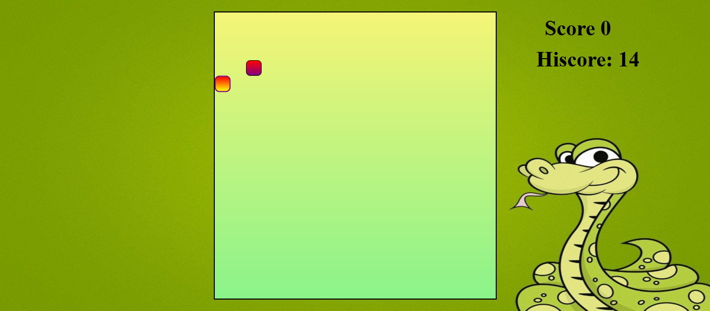

# 🐍 Snake Food Game

A simple and interactive **Snake Game** built using **HTML, CSS, and JavaScript**, featuring a clean UI, score tracking, high-score storage, sound effects, and smooth gameplay.

---

## 📸 Game Preview

> ```md
> 
> ```

---

## 🎮 Features

- 🟢 Classic Snake gameplay  
- ⭐ Score & High-Score tracking (stored in localStorage)  
- 🎵 Sound effects (food & game over)  
- 🖥️ Clean UI layout with gradient board and snake graphic  
- ⚡ Smooth keyboard controls  
- 📁 Clean and organized project structure (HTML / CSS / JS)

---

## 🛠️ Tech Stack

- **HTML5**
- **CSS3**
- **JavaScript (ES6)**
- **Firebase Hosting** (optional, if deployed)

---

## 📂 Project Structure

```
Snake Food Game/
│── .firebase/
│── node_modules/
│── public/
│ ├── css/
│ │ └── style.css
│ ├── img/
│ ├── js/
│ │ └── index.js
│ ├── music/
│ └── index.html
│── .firebaserc
│── .gitignore
│── firebase.json
│── package-lock.json
│── package.json
```


---

## 🚀 How to Run the Game

### ✔ Option 1: Run Locally  
1. Clone the repository:
   ```bash
   git clone https://github.com/YOUR-USERNAME/Snake-Food-Game.git
   ```
2. Navigate to the project:
   ```bash
   cd Snake-Food-Game/public
   ```
3. Open index.html in any web browser.

### ✔ Option 2: Run with Live Server (Best Experience)
If you are using VS Code:
1. Install the Live Server extension
2. Right-click on index.html → Open with Live Server

---   

## 🎮 Controls

| Key           | Action     |
| ------------- | ---------- |
| ⬆ Up Arrow    | Move Up    |
| ⬇ Down Arrow  | Move Down  |
| ⬅ Left Arrow  | Move Left  |
| ➡ Right Arrow | Move Right |

---
## 🤝 Contributing
- Pull requests are welcome.
- For major changes, please open an issue first to discuss what you would like to modify.

---
